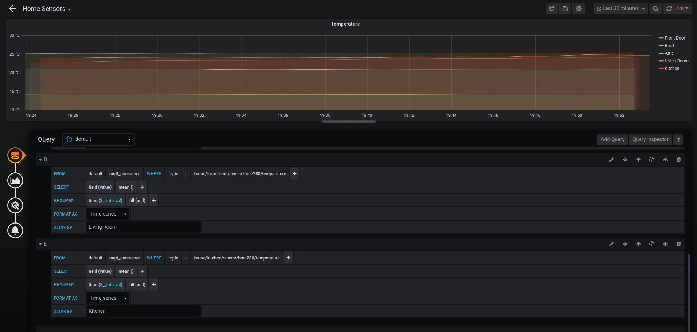

# TIG Stack
## mosquitto, telegraf, influxdb, grafana

This project is designed to work along side sensors on deviced such as the arduino and esp8266 modules. It is the "hub" for sensor data transmitted via other devices using MQTT.

It includes:
* Mosquitto message broker
* Telegraf message formatter
* InfluxDB for data storage
* Grafana for information display/dashboards

It is currently a work in progress, however should work as is.

### Usage:

clone this repository and from it's directory run `docker-compose up -d`

Setup MQTT on your sensors or other devices and have them point to the docker host (ports should be default). Use the `.docker/telegraf/telegraf.conf` file to define "Topics" you want to subscribe to.

Use grafana with the influx DB datasource and create a dashboard against your topics

